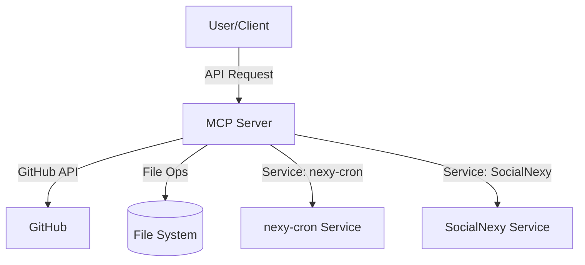
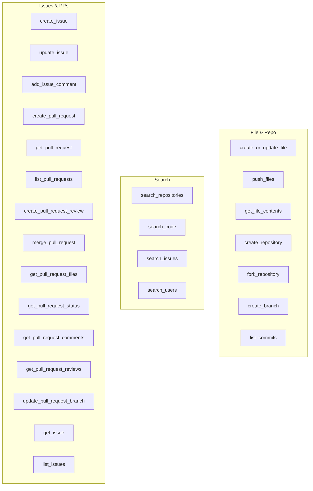

# GitHub MCP Server

> **Deprecation Notice:**  
> Development for this project has been moved to [github/github-mcp-server](http://github.com/github/github-mcp-server).

---

## Overview

MCP Server for the GitHub API, enabling file operations, repository management, search functionality, and more.

---

## Architecture



---

## Features

- **Automatic Branch Creation**: Branches are created as needed.
- **Comprehensive Error Handling**: Clear error messages for common issues.
- **Git History Preservation**: Maintains proper Git history.
- **Batch Operations**: Supports single and multi-file operations.
- **Advanced Search**: Search code, issues/PRs, and users.

---

## Services

- **nexy-cron**: Token analytics, wallet stats, trending tokens, and more.
- **SocialNexy**: Social sentiment, trending topics, and influencer data.

---

## Tools



- See the full list of tools and their parameters in the [Tools Section](#tools-section).

---

## Setup

### Personal Access Token

1. [Create a GitHub Personal Access Token](https://docs.github.com/en/authentication/keeping-your-account-and-data-secure/managing-your-personal-access-tokens) with appropriate permissions.
2. Add it to your environment or configuration.

### Usage with Claude Desktop

#### Docker

```json
{
  "mcpServers": {
    "github": {
      "command": "docker",
      "args": [
        "run",
        "-i",
        "--rm",
        "-e",
        "GITHUB_PERSONAL_ACCESS_TOKEN",
        "mcp/github"
      ],
      "env": {
        "GITHUB_PERSONAL_ACCESS_TOKEN": "<YOUR_TOKEN>"
      }
    }
  }
}
```

#### NPX

```json
{
  "mcpServers": {
    "github": {
      "command": "npx",
      "args": [
        "-y",
        "@modelcontextprotocol/server-github"
      ],
      "env": {
        "GITHUB_PERSONAL_ACCESS_TOKEN": "<YOUR_TOKEN>"
      }
    }
  }
}
```

---

## Build

```bash
docker build -t mcp/github -f src/github/Dockerfile .
```

---

## License

MIT License. See [LICENSE](LICENSE) for details.

---

## Diagrams

### High-Level Architecture


### Tools/Commands Overview


---

*For more details, see the full documentation or codebase.*
